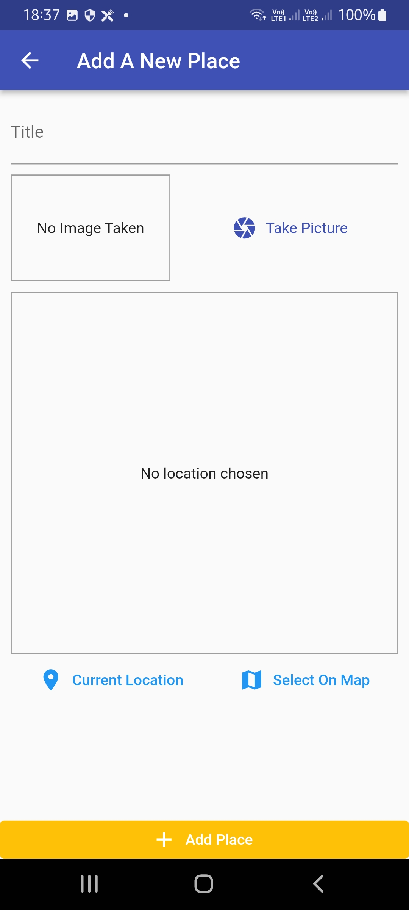
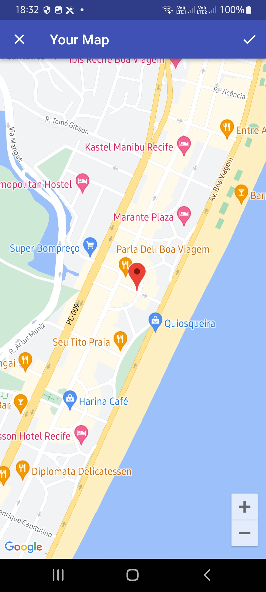
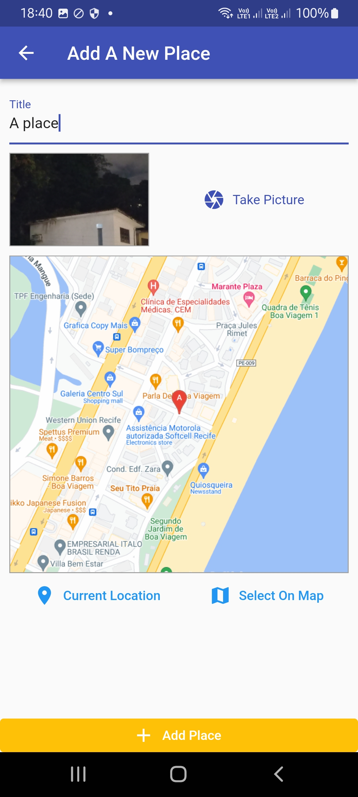

# Great Places App

Hello there.
This is a simple place picker app developed in flutter.
This app was developed according to the classes of:

Flutter & Dart - The Complete Guide [2022 Edition] - UDEMY;

### Versions

- **Flutter**: 3.0.5
- **Dart**: 2.17.6

### Setup

Clone it in your machine:
```bash
git clone https://github.com/RodrigoNP3/Great-Places-App.git
```

Dependecies

```bash
dependencies:
  cupertino_icons: ^1.0.5
  provider: ^6.0.3
  image_picker: ^0.8.5+3
  path_provider: ^2.0.11
  path: ^1.8.1
  sqflite: ^2.0.3
  location: ^4.4.0
  google_maps_flutter: ^2.1.10
  http: ^0.13.4
```

### Navigation

<table>
<thead>
<tr>
<th align="center">Home Screen</th>
<th align="center">Add Place</th>
<th align="center">Map Screen</th>
<th align="center">Simple Place Detail Screen</th>


</tr>
</thead>
<tbody>
<tr>
  
<td align="center">
  <a target="_blank" rel="" href="images/Screenshot_20220915-183107.jpg">
        

  </a></td>
  
<td align="center">
  <a target="_blank" rel="" href="images/Screenshot_20220915-183720.jpg">
        

  </a></td>
  
  
<td align="center">
  <a target="_blank" rel="" href="images/Screenshot_20220915-183242.jpg">
        

  </a></td>
  
  
<td align="center">
  <a target="_blank" rel="" href="images/Screenshot_20220915-184008.jpg">
        

  </a></td>
  
  <table>
<thead>
<tr>

<th align="center">Home Screen</th>
  <th align="center">Place Detail</th>
    <th align="center">Place Detail Map</th>

</tr>
</thead>
<tbody>
<tr>
  

  
  <td align="center">
  <a target="_blank" rel="" href="images/Screenshot_20220915-183306.jpg">
        

  </a></td>
    <td align="center">
  <a target="_blank" rel="" href="images/Screenshot_20220915-183315.jpg">
        

  </a></td>
  <td align="center">
  <a target="_blank" rel="" href="images/Screenshot_20220915-183326.jpg">
        

  </a></td>
  
  
 
  
